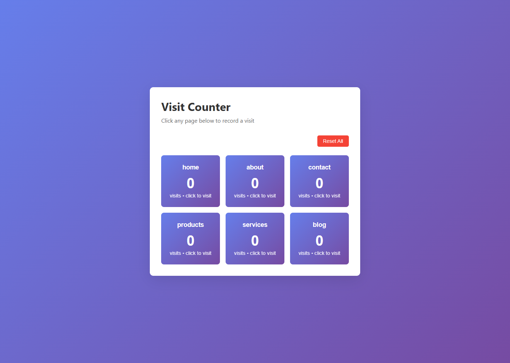
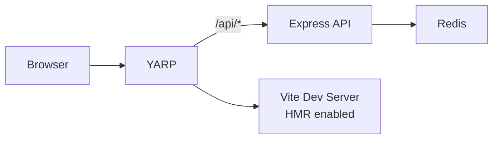
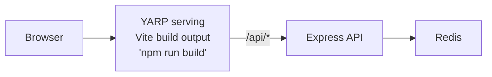

# Node.js Express + Redis + Vite Frontend



Visit counter with Express backend, Redis caching, and React TypeScript frontend using YARP.

## Architecture

**Run Mode:**


**Publish Mode:**


## What This Demonstrates

- **addNodeApp**: Express backend with Redis integration
- **addViteApp**: React + TypeScript frontend with Vite
- **addYarp**: Single endpoint for frontend and API with path transforms
- **addRedis**: In-memory data store with automatic connection injection
- **publishWithStaticFiles**: Frontend embedded in YARP for publish mode
- **Dual-Mode Operation**: Vite HMR in run mode, Vite build output in publish mode

## Running

```bash
aspire run
```

## Security Notes

This sample keeps the Express endpoints public and unauthenticated so the visit counter is easy to run and inspect locally. It does not add CSRF protection, rate limiting, authentication, or authorization, so treat it as a demo pattern rather than production-ready API security.

The API accepts visits only for the sample's built-in pages and uses bounded Redis operations for stats and reset. Production services still need deliberate cache and key management to avoid unbounded key cardinality, accidental deletion of unrelated keys, or expensive enumeration against shared Redis instances.

For production applications, add real authN/authZ, request rate limiting, CSRF protection where browser credentials are used, bounded request bodies, and Redis security controls appropriate for your deployment. See the [Node.js security best practices](https://nodejs.org/en/learn/getting-started/security-best-practices), [Express body parser limits documentation](https://expressjs.com/en/resources/middleware/body-parser.html), [Redis security documentation](https://redis.io/docs/latest/operate/oss_and_stack/management/security/), and [OWASP API Security Top 10](https://owasp.org/API-Security/editions/2023/en/0x11-t10/).

## Commands

```bash
aspire run      # Run locally
aspire deploy   # Deploy to Docker Compose
aspire do docker-compose-down-dc  # Teardown deployment
```

## Key Aspire Patterns

**YARP Routing** - Single endpoint with path-based routing:
```ts
await builder.addYarp("app")
    .withConfiguration(async (yarp) =>
    {
        const apiCluster = await yarp.addClusterFromResource(api);
        await (await yarp.addRoute("api/{**catch-all}", apiCluster))
            .withTransformPathRemovePrefix("/api");

        if (await executionContext.isRunMode.get())
        {
            const frontendCluster = await yarp.addClusterFromResource(frontend);
            await yarp.addRoute("{**catch-all}", frontendCluster);
        }
    })
    .publishWithStaticFiles(frontend);
```

**Redis Connection** - Automatic connection string injection via `REDIS_URI` environment variable

**WaitFor** - Ensures Redis starts before API
