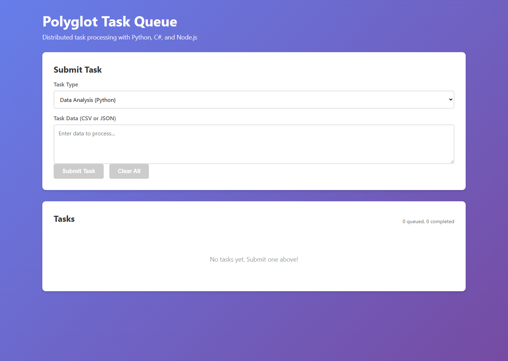
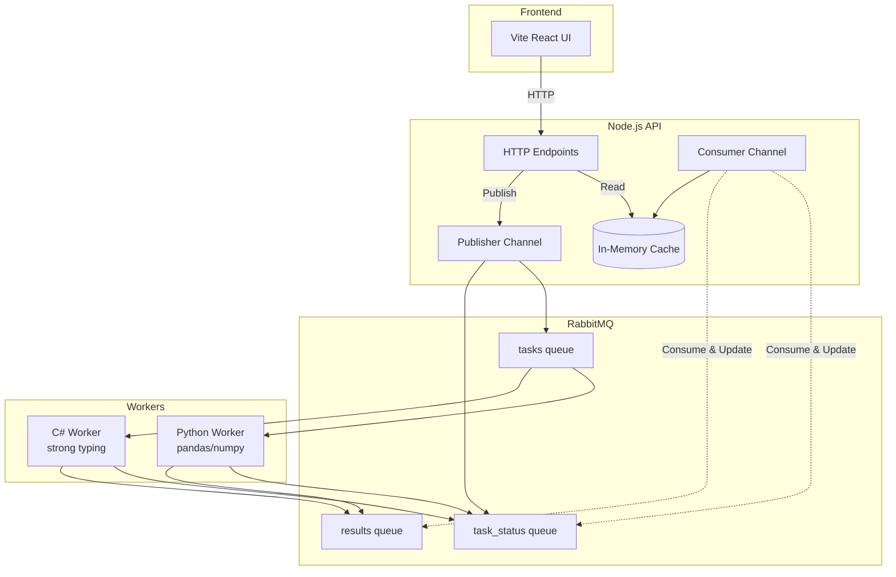

# Polyglot Task Queue



Distributed task processing with Python, C#, and Node.js workers using RabbitMQ and end-to-end OpenTelemetry tracing.

## Architecture



**RabbitMQ is the source of truth** - API maintains in-memory cache built from consuming messages.

## What This Demonstrates

- **addRabbitMQ**: Message queue with management plugin
- **addNodeApp**: Express API with dual RabbitMQ channels (publisher + consumer)
- **addPythonApp**: Python worker with pandas/numpy for data analysis
- **addCSharpApp**: C# worker with strong typing for reports
- **addViteApp**: React + TypeScript frontend
- **OpenTelemetry**: End-to-end distributed tracing across all services
- **Trace Context Propagation**: OpenTelemetry context through RabbitMQ headers
- **Messaging Semantic Conventions**: Standardized span attributes for queue operations
- **Event-Driven State**: Stateless API, RabbitMQ as source of truth

## Running

```bash
aspire run
```

## Commands

```bash
aspire run      # Run locally
aspire deploy   # Deploy to Docker Compose
aspire do docker-compose-down-dc  # Teardown deployment
```

## Security Notes

This sample is intended for local demo use. RabbitMQ messages are treated as trusted internal messages, and the public HTTP endpoints are unauthenticated.

The Node.js API applies simple guardrails for the demo: JSON request bodies are limited to 64 KB, task `type` must be `analyze` or `report`, task `data` is capped at 10,000 characters, and `GET /tasks` returns the latest 100 tasks by default with `?limit=` capped at 500. Production services should add explicit input schemas, authentication and authorization, rate limits, a RabbitMQ retry/dead-letter policy, and capacity limits for queues, stored results, and in-memory caches.

The workers acknowledge or drop invalid and failed messages instead of requeueing indefinitely. For production, configure bounded retries and a dead-letter exchange so poison messages can be inspected without blocking queue processing.

Relevant references:

- [Node.js security best practices](https://nodejs.org/en/learn/getting-started/security-best-practices)
- [Express body parser limits](https://expressjs.com/en/resources/middleware/body-parser.html)
- [RabbitMQ consumer acknowledgements and publisher confirms](https://www.rabbitmq.com/docs/confirms)
- [RabbitMQ dead letter exchanges](https://www.rabbitmq.com/docs/dlx)
- [OWASP API Security Top 10](https://owasp.org/API-Security/editions/2023/en/0x11-t10/)

## Key Aspire Patterns

**RabbitMQ Setup** - Message queue with management UI:
```ts
const rabbitmq = await builder.addRabbitMQ("messaging")
    .withManagementPlugin()
    .withLifetime(ContainerLifetime.Persistent)
    .withUrlForEndpoint("management", async (url) =>
    {
        url.displayText = "RabbitMQ Management UI";
    });
```

**OpenTelemetry** - Automatic configuration via environment variables:
- `OTEL_EXPORTER_OTLP_ENDPOINT`: Aspire dashboard endpoint
- `OTEL_SERVICE_NAME`: Service identifier for traces

**Service References** - Automatic connection injection:
```ts
const api = await builder.addNodeApp("api", "./api", "index.js")
    .waitFor(rabbitmq)
    .withReference(rabbitmq); // Injects MESSAGING_URI
```

**Trace Context Propagation** - OpenTelemetry context through message headers:
```javascript
// Node.js - Inject context
propagation.inject(context.active(), headers);
channel.sendToQueue(queue, Buffer.from(JSON.stringify(message)), { headers });

// Extract context
const parentContext = propagation.extract(context.active(), msg.properties.headers);
```

```python
# Python - Extract context
ctx = propagate.extract(dict(message.headers) if message.headers else {})
with tracer.start_as_current_span('process task', context=ctx):
    # Process task
```

**Messaging Semantic Conventions**:
- `messaging.system`: "rabbitmq"
- `messaging.destination.name`: Queue name
- `messaging.operation`: "publish" or "process"
