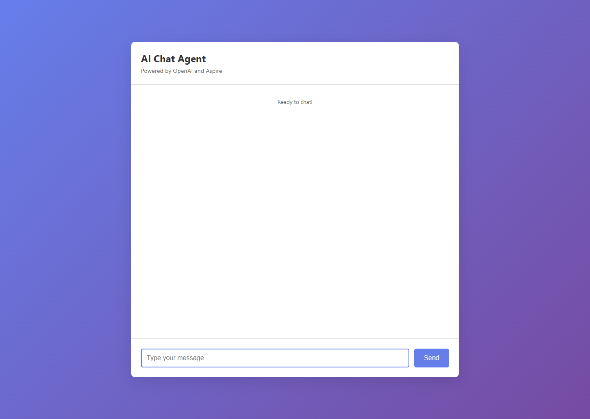

# Python OpenAI Agent Sample



**Python FastAPI AI agent with OpenAI integration demonstrating AI workloads with Aspire.**

This sample demonstrates Aspire 13's Python support combined with AI workloads, showcasing a Python-based AI chat agent powered by OpenAI.

## Quick Start

### Prerequisites

- [Aspire CLI](https://aspire.dev/get-started/install-cli/)
- [Docker](https://docs.docker.com/get-docker/)
- [Python 3.8+](https://www.python.org/)
- [uv](https://github.com/astral-sh/uv)
- OpenAI API key

### Commands

```bash
aspire run      # Run locally
aspire deploy   # Deploy to Docker Compose
aspire do docker-compose-down-dc  # Teardown deployment
```

When you run the app for the first time, Aspire will prompt you for your OpenAI API key.

## Overview

The application consists of:

- **Aspire AppHost** - Orchestrates the Python AI agent
- **Python AI Agent** - FastAPI service with web UI and REST API powered by OpenAI
- **Chat UI** - Simple web interface for chatting with the AI agent

## Key Code

The `apphost.ts` configuration demonstrates AI workloads with Aspire:

```ts
import { createBuilder } from "./.modules/aspire.js";

const builder = await createBuilder();

await builder.addDockerComposeEnvironment("dc");

const openAiApiKey = await builder.addParameter("openai-api-key", { secret: true });

await builder.addOpenAI("openai")
    .withApiKey(openAiApiKey);

await builder.addUvicornApp("ai-agent", "./agent", "main:app")
    .withUv()
    .withExternalHttpEndpoints()
    .withEnvironment("OPENAI_API_KEY", openAiApiKey);

await builder.build().run();
```

Key features:

- **Python AI Integration**: Uses `addUvicornApp` to run FastAPI with OpenAI SDK
- **OpenAI Integration**: `addOpenAI` prompts for API key on first run and securely stores it
- **Direct Key Injection**: The OpenAI API key is passed directly to the Python app as `OPENAI_API_KEY`
- **uv Package Manager**: Uses `.withUv()` for fast dependency installation from `pyproject.toml`
- **Web UI**: Clean, modern chat interface for interacting with the AI
- **Automatic Virtual Environment**: Aspire creates `.venv` and installs dependencies with uv
- **External HTTP Endpoints**: AI agent accessible externally for testing
- **Session Management**: Maintains conversation history per session for context-aware responses

## Accessing the Application

Once you run `aspire run`, you can access the AI agent in two ways:

### 1. Web UI (Recommended)

Open your browser and navigate to the AI agent's endpoint shown in the Aspire Dashboard. You'll see a clean chat interface where you can:
- Type messages and get AI responses
- See conversation history
- Watch typing indicators while the AI thinks
- Get automatic session management

### 2. REST API

The Python AI agent also provides REST endpoints:

- `GET /` - Serves the chat UI
- `GET /api` - API information
- `GET /health` - Health check (shows OpenAI availability)
- `POST /chat` - Send a message and get AI response
- `GET /sessions` - List active conversation sessions
- `DELETE /sessions/{id}` - Clear a conversation session

## Security Notes

This sample is instructional and is not production-ready; see the repository's
[security disclaimer](../../README.md#security-disclaimer). By default, `/chat`
is anonymous. If you configure `AGENT_API_KEY`, `/chat`, `GET /sessions`, and
`DELETE /sessions/{id}` require the same value in the `X-API-Key` header.

The code includes basic OpenAI quota and cost controls: message length,
session/history caps, response token caps, per-client rate limiting, and a model
allow-list. Production deployments should add real authentication and
authorization (see [FastAPI security](https://fastapi.tiangolo.com/tutorial/security/)),
abuse monitoring, persistent session storage if conversations must survive
process restarts, and prompt/content safety controls aligned with
[OpenAI production best practices](https://developers.openai.com/api/docs/guides/production-best-practices),
[OpenAI safety best practices](https://developers.openai.com/api/docs/guides/safety-best-practices),
and [OWASP LLM Prompt Injection](https://genai.owasp.org/llmrisk/llm01-prompt-injection/)
guidance.

## Example API Usage

You can also interact with the AI agent programmatically via its REST API:

```bash
# Send a chat message
curl -X POST http://localhost:<port>/chat \
  -H "Content-Type: application/json" \
  -d '{"message": "What is the fastest land animal?", "session_id": "my-session"}'

# Check health
curl http://localhost:<port>/health

# List active sessions
curl http://localhost:<port>/sessions
```

## How It Works

1. **Virtual Environment**: Aspire automatically creates a `.venv` directory for the Python agent
2. **Fast Dependency Installation**: uv installs dependencies from `pyproject.toml` (much faster than pip)
3. **AI Agent Startup**: The Python FastAPI app initializes the OpenAI client with the provided API key
4. **Web UI**: The root endpoint (`/`) serves a static HTML chat interface
5. **REST API**: Additional endpoints for programmatic access
6. **Session Management**: The agent maintains conversation history per session for context-aware responses

## VS Code Integration

This sample includes VS Code configuration for Python development:

- **`.vscode/settings.json`**: Configures the Python interpreter to use the Aspire-created virtual environment
- After running `aspire run`, open the sample in VS Code for full IntelliSense and debugging support
- The virtual environment at `agent/.venv` will be automatically detected

## Deployment

Deploy to Docker Compose:

```bash
aspire deploy
```

This will:

1. Generate a Dockerfile for the Python application
2. Install Python dependencies and build container image
3. Generate Docker Compose configuration
4. Deploy the application stack

## Development Tips

- The Python app uses automatic dependency installation via `pyproject.toml` with uv (much faster than pip)
- Hot reload is enabled for local development
- OpenAI responses are stored in session history for contextual conversations
- Use the Aspire Dashboard to view logs and monitor the agent
- uv automatically creates a `uv.lock` file for reproducible builds
