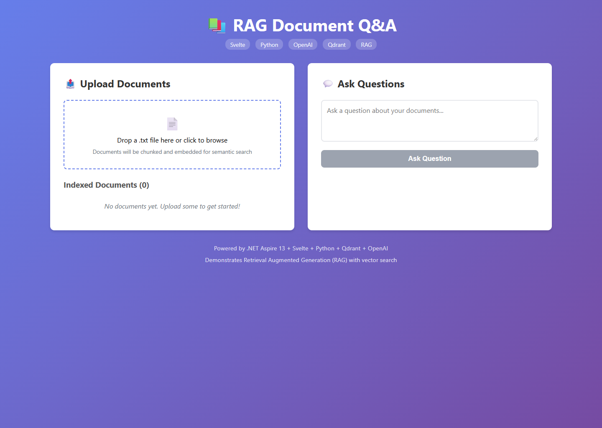
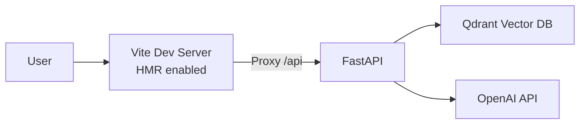
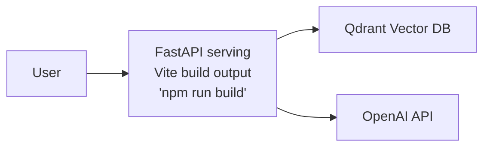

# RAG Document Q&A with Svelte



Upload documents and ask questions using Retrieval Augmented Generation with vector search.

## Architecture

**Run Mode:**


**Publish Mode:**


## What This Demonstrates

- **RAG Pattern**: Document upload → chunk → embed → vector search → GPT answer
- **addUvicornApp**: Python FastAPI backend with uv package manager
- **addViteApp**: Svelte 5 frontend with Vite
- **addQdrant**: Vector database for semantic search
- **addOpenAI**: Secure API key management
- **publishWithContainerFiles**: Frontend embedded in API for publish mode

## Running

```bash
aspire run
```

Aspire will prompt for your OpenAI API key on first run.

## Security Notes

This is a local-first sample, not a production-ready document service. Uploaded documents are untrusted input and the API only accepts UTF-8 `.txt` text uploads with size, chunk, question length, and per-client rate limits to reduce accidental OpenAI cost or quota burn.

RAG apps can be affected by prompt injection and data disclosure risks because retrieved document text is placed into model context. The sample does not provide tenant isolation, document deletion controls, malware/content scanning, or durable data-retention policies.

Before adapting this for production, add real authentication and authorization, data retention and deletion workflows, monitoring, and malware/content scanning as appropriate for your data. Relevant references include [FastAPI security](https://fastapi.tiangolo.com/tutorial/security/), [OWASP LLM01 Prompt Injection](https://genai.owasp.org/llmrisk/llm01-prompt-injection/), [OWASP LLM02 Sensitive Information Disclosure](https://genai.owasp.org/llmrisk/llm022025-sensitive-information-disclosure/), [OWASP LLM08 Vector and Embedding Weaknesses](https://genai.owasp.org/llmrisk/llm082025-vector-and-embedding-weaknesses/), and OpenAI's [production best practices](https://developers.openai.com/api/docs/guides/production-best-practices) and [safety best practices](https://developers.openai.com/api/docs/guides/safety-best-practices).

## Commands

```bash
aspire run      # Run locally
aspire deploy   # Deploy to Docker Compose
aspire do docker-compose-down-dc  # Teardown deployment
```

## Key Aspire Patterns

**Static File Embedding** - Frontend proxied in run mode, embedded in publish mode:
```ts
const openAiApiKey = await builder.addParameter("openai-api-key", { secret: true });
const qdrant = await builder.addQdrant("qdrant");

await builder.addOpenAI("openai")
    .withApiKey(openAiApiKey);

const api = await builder.addUvicornApp("api", "./api", "main:app")
    .withUv()
    .waitFor(qdrant)
    .withReference(qdrant)
    .withEnvironment("OPENAI_APIKEY", openAiApiKey);

const frontend = await builder.addViteApp("frontend", "./frontend")
    .withReference(api)
    .withUrl("", { displayText: "RAG UI" });

await api.publishWithContainerFiles(frontend, "public");
```

**Python + uv** - Fast dependency installation from `pyproject.toml`

**Vector Database** - `addQdrant()` for semantic search

**OpenAI Integration** - `addOpenAI()` prompts for API key on first run
