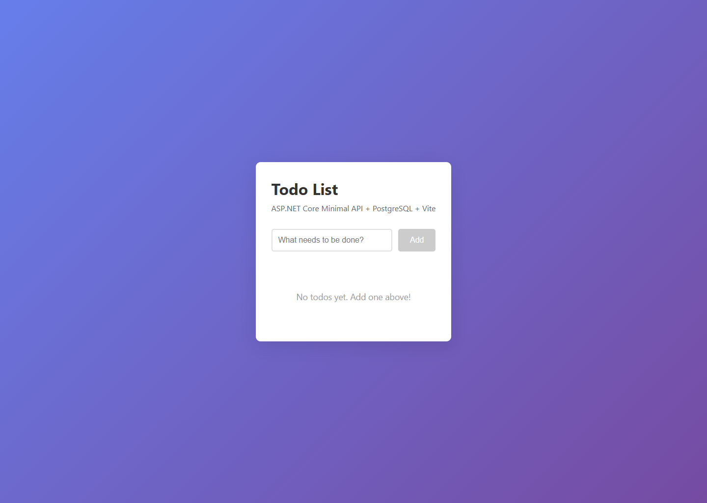
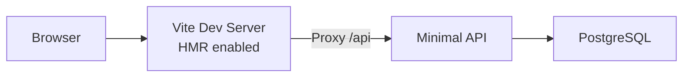
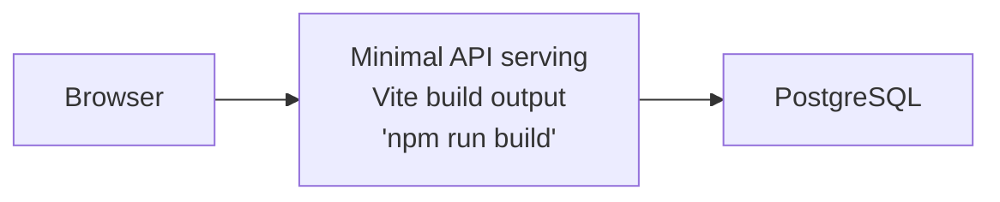

# ASP.NET Core Minimal API + PostgreSQL + Vite



Todo app with C# Minimal APIs, Entity Framework Core, PostgreSQL, and React TypeScript frontend.

## Architecture

**Run Mode:**


**Publish Mode:**


## What This Demonstrates

- **addCSharpApp**: ASP.NET Core Minimal API with EF Core
- **addViteApp**: React + TypeScript frontend with Vite
- **addPostgres**: PostgreSQL database with pgAdmin
- **publishWithContainerFiles**: Frontend embedded in API's wwwroot for publish mode
- **AddNpgsqlDbContext**: Automatic PostgreSQL connection injection
- **withUrlForEndpointFactory**: Custom dashboard links (Scalar API docs, Todo UI)
- **waitFor**: Ensures PostgreSQL starts before API

## Running

```bash
aspire run
```

## Security Notes

This sample is intentionally small and demo-focused. The todo CRUD endpoints under `/api/todos` are public and unauthenticated, and the app does not add authentication, authorization, CSRF protection, or rate limiting. `GET /api/todos` applies bounded pagination with `offset` and `limit` query parameters, defaulting to 50 items and capping responses at 100 items.

The PostgreSQL pgAdmin container is included as local demo tooling. Do not expose pgAdmin or these unauthenticated CRUD endpoints directly in production.

For production deployments, review the [ASP.NET Core security overview](https://learn.microsoft.com/aspnet/core/security/), add appropriate authentication and authorization, keep request validation in place using [ASP.NET Core minimal API parameter validation](https://learn.microsoft.com/aspnet/core/fundamentals/minimal-apis/parameter-binding?view=aspnetcore-10.0#parameter-validation), add [rate limiting](https://learn.microsoft.com/aspnet/core/performance/rate-limit), use [antiforgery APIs](https://learn.microsoft.com/aspnet/core/security/anti-request-forgery) when browser clients rely on cookies, and evaluate the [OWASP API Security Top 10](https://owasp.org/API-Security/editions/2023/en/0x11-t10/).

## Commands

```bash
aspire run      # Run locally
aspire deploy   # Deploy to Docker Compose
aspire do docker-compose-down-dc  # Teardown deployment
```

## Key Aspire Patterns

**Container Files Publishing** - Frontend embedded in API's wwwroot:
```ts
const postgres = await builder.addPostgres("postgres")
    .withDataVolume()
    .withLifetime(ContainerLifetime.Persistent)
    .withPgAdmin({
        configureContainer: async (pgAdmin) =>
        {
            await pgAdmin.withLifetime(ContainerLifetime.Persistent);
        }
    });

const db = await postgres.addDatabase("db");

const api = await builder.addCSharpApp("api", "./api")
    .withHttpHealthCheck({ path: "/health" })
    .withExternalHttpEndpoints()
    .waitFor(db)
    .withReference(db)
    .withUrlForEndpointFactory("https", async (endpoint) => ({
        url: `${await endpoint.url.get()}/scalar`,
        displayText: "API Reference"
    }));

const frontend = await builder.addViteApp("frontend", "./frontend")
    .withReference(api)
    .withUrl("", { displayText: "Todo UI" });

await api.publishWithContainerFiles(frontend, "wwwroot");
```

**EF Core Integration** - Automatic connection string injection:
```csharp
builder.AddNpgsqlDbContext<TodoDbContext>("db");
```

**Static File Serving** - API serves embedded frontend in publish mode:
```csharp
app.UseFileServer(); // Serves wwwroot/index.html and assets
```
