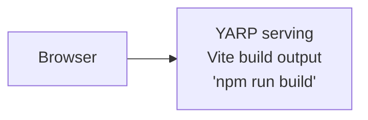

# YARP Serving Static Files


YARP reverse proxy serving a Vite frontend with dual-mode operation (dev HMR + production static files).

## Architecture

**Run Mode:**


**Publish Mode:**


## What This Demonstrates

- **addViteApp**: Vite-based frontend application
- **addYarp**: Reverse proxy with dual-mode routing
- **publishWithStaticFiles**: Automatic static file serving in production
- **executionContext.isRunMode**: Different behavior for dev vs production
- **Minimal AppHost**: Single-file orchestration

## Running

```bash
aspire run
```

## Commands

```bash
aspire run      # Run locally
aspire deploy   # Deploy to Docker Compose
aspire do docker-compose-down-dc  # Teardown deployment
```

## Key Aspire Patterns

**Dual-Mode YARP** - Run mode proxies to Vite, publish mode serves static files:
```ts
import { createBuilder } from "./.modules/aspire.js";

const builder = await createBuilder();
const executionContext = await builder.executionContext.get();
const frontend = await builder.addViteApp("frontend", "./frontend");

await builder.addYarp("app")
    .withConfiguration(async (yarp) =>
    {
        if (await executionContext.isRunMode.get())
        {
            const frontendCluster = await yarp.addClusterFromResource(frontend);
            await yarp.addRoute("{**catch-all}", frontendCluster);
        }
    })
    .publishWithStaticFiles(frontend);
```

**Single Entry Point** - YARP provides one external endpoint for the entire application
